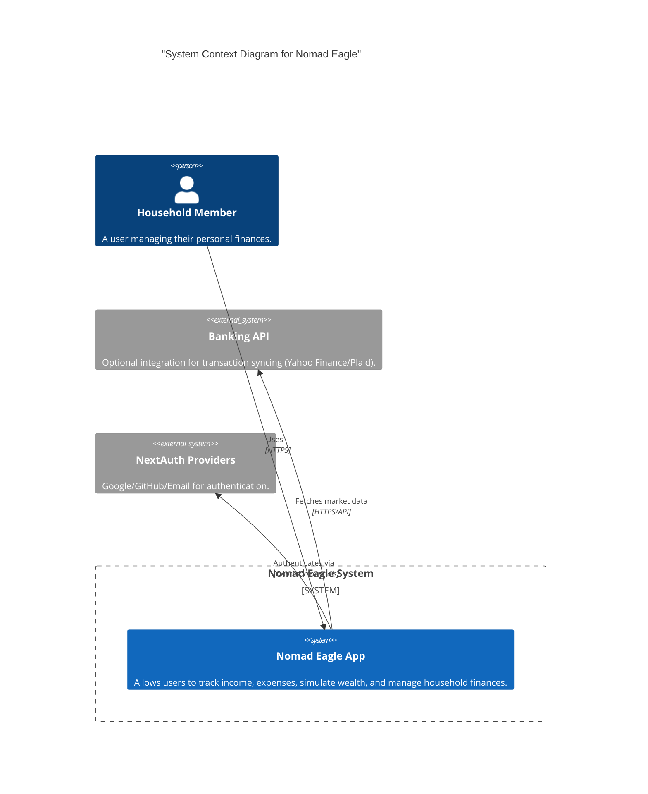
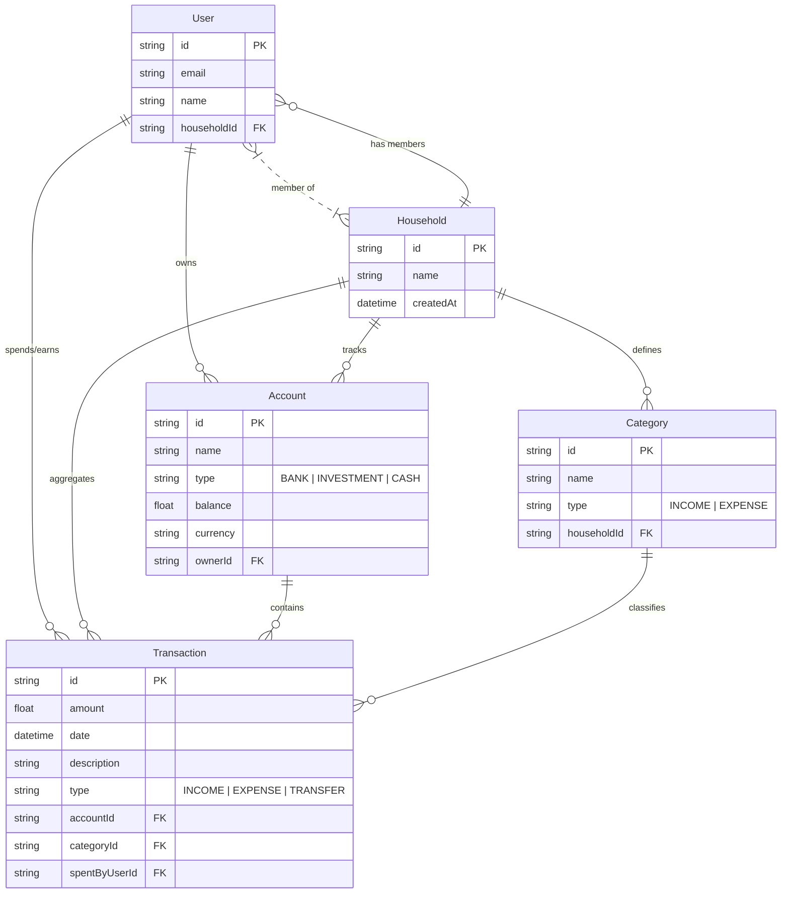

# Genesis: System Architecture & Security Log

Generated on: 2026-02-07T16:44:27.293Z


## Architecture Decision Records

### 0000-use-adrs.md

# 0. Record architecture decisions

Date: 2026-02-07

## Status

Accepted

## Context

We need to record architectural decisions made on this project.

## Decision

We will use Architecture Decision Records (ADR) to record unrelated or significant architectural decisions.

We will use the format described by Michael Nygard in this article: http://thinkrelevance.com/blog/2011/11/15/documenting-architecture-decisions

## Consequences

See Michael Nygard's article, linked above.


---

### 0001-modular-monolith.md

# 1. Adopt Modular Monolith Architecture

Date: 2026-02-07

## Status

Accepted

## Context

The project requires a scalable yet manageable architecture that allows for rapid iteration without the complexity of microservices. We need clear boundaries between different business domains (Transactions, Wealth, Auth) while maintaining a single deployable unit.

## Decision

We will adopt a **Modular Monolith** architecture.

-   **Structure**: The codebase is organized by feature/domain (e.g., `components/dashboard`, `components/wealth`, `server/actions`).
-   **Communication**: Modules communicate via direct function calls (Server Actions) rather than network calls, preserving transactional integrity.
-   **Database**: A single shared database (PostgreSQL via Prisma) is used, but domains should ideally own their schema sections.

## Consequences

-   **Pros**: Simplified deployment, easier refactoring, shared types, transactional consistency.
-   **Cons**: Potential for tight coupling if boundaries aren't enforced.


---

### 0002-tech-stack.md

# 2. Technology Stack Selection

Date: 2026-02-07

## Status

Accepted

## Context

We need a modern, type-safe, and performant stack for building a full-stack web application.

## Decision

We have selected the following core technologies:

1.  **Framework**: **Next.js (App Router)** for its React Server Components, routing, and full-stack capabilities.
2.  **Language**: **TypeScript** for strict type safety and developer experience.
3.  **Database ORM**: **Prisma** for its intuitive schema definition and type-safe database queries.
4.  **Styling**: **Tailwind CSS** for utility-first styling and rapid UI development.
5.  **Component Library**: **Shadcn UI** (based on Radix UI) for accessible, customizable, and copy-pasteable components.
6.  **Authentication**: **NextAuth.js** for secure and flexible authentication.

## Consequences

-   **Uniformity**: A cohesive ecosystem (React/TS/Tailwind) reduces context switching.
-   **Performance**: Server Components reduce client-side JavaScript.
-   **Velocity**: High-level abstractions (Prisma, Next.js) speed up development.


---

### 0003-server-actions.md

# 3. Use Server Actions for Data Mutations

Date: 2026-02-07

## Status

Accepted

## Context

We need a standard way to handle form submissions and data mutations (Create, Update, Delete). API routes can be verbose and require separate client-side fetching logic.

## Decision

We will primarily use **React Server Actions** for all data mutations.

-   Actions are defined in `src/server/actions`.
-   They are invoked directly from client components (via `useActionState` or form `action` prop).
-   They handle input validation (Zod), authorization, and database interaction.

## Consequences

-   **Simplicity**: No need to manually define API endpoints or manage `fetch` calls.
-   **Type Safety**: Arguments and return types are fully typed.
-   **Progressive Enhancement**: Works without JS if designed correctly (though verify application requirements).


---

### 0004-protocols.md

# 4. Protocol-Driven Governance

Date: 2026-02-07

## Status

Accepted

## Context

To ensure long-term maintainability and alignment with high architectural standards, we need a governance model that goes beyond code style guides.

## Decision

We adopt a **Protocol-Driven Development** model, governed by explicitly defined Context Files (`Singularity`, `Strategist`, `Architect`, `Protocols`).

-   **The Council**: A conceptual governance body (represented by these protocols and the AI agents enforcing them).
-   **Key Protocols**:
    -   *Protocol 4 (Topology)*: Unidirectional dependency flow.
    -   *Protocol 6 (The Core)*: Hermetic business logic.
    -   *Protocol 13 (Shield)*: Zero-trust security.
    -   *Protocol 16 (GitOps)*: Single source of truth.

## Consequences

-   **High Standards**: Every change is evaluated against these high-level principles.
-   **Cognitive Load**: Developers must be aware of these protocols.
-   **Consistency**: Decisions are less arbitrary and more rooted in agreed-upon laws.


---

### 0005-household-isolation.md

# 5. Enforce Strict Household Isolation

Date: 2026-02-07

## Status

Accepted

## Context

Red Team analysis (`RedTeam/0002-idor-transactions.md`) revealed that cross-household transactions were possible because authorization checks relied solely on personal ownership (`ownerId`), ignoring the `householdId` scope. This allows users to potentially interact with "Joint Accounts" of other households.

## Decision

We will enforce strict **Household Isolation** for all resource access.

1.  **Rule**: All database queries for resources (Accounts, Transactions, Categories) must include a filter for `householdId` matching the current user's session.
2.  **Implementation**:
    -   When fetching an updated/deleted resource, verify `resource.householdId === session.user.householdId`.
    -   When creating a resource linked to a parent (e.g., Transaction -> Account), verify the parent belongs to the session's household.

## Consequences

-   **Security**: Prevents horizontal privilege escalation (IDOR) between households.
-   **Performance**: Adds a slight overhead for extra checks, but negligible.
-   **Refactoring**: Requires updating existing server actions (`transactions.ts`, `accounts.ts`) to include these checks.


---

### 0006-secure-investment-ops.md

# 6. Secure Investment Operations

Date: 2026-02-07

## Status

Accepted

## Context

Red Team analysis (`RedTeam/0001-idor-investments.md`) identified that investment positions could be created in *any* account/household due to missing ownership verification in `createPosition`.

## Decision

We will implement mandatory ownership verification for all investment operations.

1.  **Creation**: Before creating an `InvestmentPosition`, we must fetch the target `Account` and verify it belongs to the user's `householdId`.
2.  **Modification/Deletion**: Verify the existing `InvestmentPosition` (via its `Account`) belongs to the user's `householdId`.

## Consequences

-   **Security**: Mitigates arbitrary data injection into other users' portfolios.
-   **Code Change**: We must update `src/server/actions/investments.ts`.


---

### 0007-secure-household-invites.md

# 7. Secure Household Invites

Date: 2026-02-07

## Status

Accepted

## Context

Red Team analysis (`RedTeam/0007-weak-household-codes.md`) identified that the current 6-character invite codes (e.g., "ABC-123") have insufficient entropy (~17.5M combinations), making them vulnerable to brute-force attacks. Access to a household grants full visibility into financial data.

## Decision

We will increase the security of household invite codes by:

1.  **High Entropy**: Replacing the 6-char format with a **12-character** alphanumeric code (e.g., `A7X2-9BWD-4Q8Z`).
2.  **Cryptographic Randomness**: Utilizing `crypto.randomBytes` (or equivalent secure RNG) instead of `Math.random()`.
3.  **Validation**: Retaining the existing checks but ensuring the code complexity makes online brute-force infeasible.

## Consequences

-   **Security**: Increases search space to $36^{12} \approx 4.7 \times 10^{18}$, making brute-force mathematically impossible within reasonable timeframes.
-   **UX**: Codes will be slightly harder to type/share verbally, but safer.
-   **Implementation**: Updates required in `src/server/actions/household.ts`.


---


## Red Team Reports

### 0000-init.md

# 0. Initialize Red Team Reports

Date: 2026-02-07

## Status

ACCEPTED

## Context

We need a structured way to document security findings, vulnerabilities, and adversarial simulations (Red Team exercises) as per Protocol 13 (Shield) and Protocol 17 (Sentinel).

## Decision

We will document all Red Team findings in this `RedTeam` directory using the Architecture Decision Record (ADR) format. This ensures that security decisions are treated with the same architectural rigor as code changes.

## Consequences

-   All security findings will be immutable and version-controlled.
-   Mitigations must be explicitly documented.


---

### 0001-idor-investments.md

# IDOR in Investment Position Creation

Date: 2026-02-07

## Status

IDENTIFIED

## Context

The `createPosition` server action in `src/server/actions/investments.ts` accepts an `accountId` from the form data to link the new investment position.

```typescript
const accountId = formData.get("accountId") as string
// ...
await prisma.investmentPosition.create({
    data: {
        // ...
        accountId
    }
})
```

## Vulnerability

There is **no verification** that the provided `accountId` belongs to the current user's household or is owned by the user. An attacker could inspect the network request, change the `accountId` to a valid ID from another user/household, and successfully create an investment position in that target account.

## Impact

-   **Integrity**: Attackers can inject data into other users' portfolios.
-   **Confidentiality**: Low (doesn't reveal data directly), but could be used to probe for valid IDs.

## Mitigation

Add a database check before creation:

```typescript
const account = await prisma.account.findUnique({ where: { id: accountId } })
if (!account || account.householdId !== session.user.householdId) {
    return { error: "Unauthorized account" }
}
```


---

### 0002-idor-transactions.md

# IDOR in Transaction Creation (Cross-Household)

Date: 2026-02-07

## Status

IDENTIFIED

## Context

The `createTransaction` action in `src/server/actions/transactions.ts` performs ownership checks, but they are incomplete.

```typescript
// Standard Logic
if (account.ownerId && account.ownerId !== session.user.id) {
    return { error: "Unauthorized access to this account" }
}
```

## Vulnerability

The current check only verifies personal ownership (`ownerId`). It **does not verify Household membership**.

If an account is a "Joint Account" (where `ownerId` is typically null), the check `(account.ownerId && ...)` evaluates to `false` (safe), effectively bypassing the blocking condition.

This means a user from **Household A** could create a transaction in a Joint Account of **Household B** if they guess the `accountId`.

## Impact

-   **Financial Integrity**: Attackers can drain or pollute the transaction history of other households' joint accounts.
-   **Severity**: High.

## Mitigation

Enforce strict Household isolation:

```typescript
if (account.householdId !== session.user.householdId) {
    return { error: "Unauthorized: Account belongs to another household" }
}
```


---

### 0007-weak-household-codes.md

# Weak Household Invite Codes

Date: 2026-02-07

## Status

IDENTIFIED

## Context

The `generateInviteCode` function in `src/server/actions/household.ts` generates a 6-character code (Format: `AAA-000`) for joining households.

```typescript
const chars = "ABCDEFGHIJKLMNOPQRSTUVWXYZ"
const nums = "0123456789"
// ... 3 chars + 3 nums
```

## Vulnerability

**Low Entropy / Brute-Force Susceptibility**

-   **Entropy**: The search space is $26^3 \times 10^3 = 17,576,000$ combinations.
-   **Attack Vector**: An attacker can enumerate codes to randomly join households.
-   **Impact**: Successful joining grants **full access** to the household's financial data (accounts, transactions, balances), representing a catastrophic privacy breach.
-   **Missing Controls**: There appears to be no rate limiting on the `joinHousehold` action.

## Mitigation

1.  **Increase Entropy**: Use longer codes (e.g., 8-10 chars alphanumeric) or signed JWTs.
2.  **Rate Limiting**: Implement strict rate limits on the `joinHousehold` endpoint (e.g., 5 attempts per IP per hour).
3.  **Approval Workflow**: Require the Household Owner to "Approve" a join request, rather than auto-joining via code.


---


## Schemas & Blueprints

### 01-system-context.md

# 1. System Context Diagram

Date: 2026-02-07

## Overview

High-level view of the Nomad Eagle system and its interaction with external systems.

## Diagram




---

### 02-database-erd.md

# 2. Database Entity Relationship Diagram

Date: 2026-02-07

## Overview

Visual representation of the Prisma schema, highlighting the relationships between User, Household, Account, and Transaction entities.

## Diagram




---

### README.md

# Schema & Blueprints

This directory contains the schematics and blueprints for the application. 

## Structure

- **Schematics**: Technical diagrams, data flow charts, and component hierarchies.
- **Blueprints**: Architectural plans, UI flows, and high-level design documents.


---

