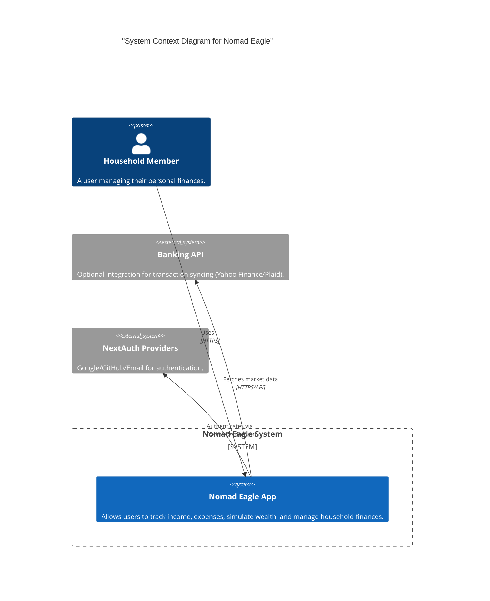

# 1. System Context Diagram

Date: 2026-02-07

## Overview

High-level view of the Nomad Eagle system and its interaction with external systems.

## Diagram

```mermaid
C4Context
    title "System Context Diagram for Nomad Eagle"

    Person(User, "Household Member", "A user managing their personal finances.")
    System_Boundary(NE_Boundary, "Nomad Eagle System") {
        System(NomadEagle, "Nomad Eagle App", "Allows users to track income, expenses, simulate wealth, and manage household finances.")
    }
    System_Ext(Banking, "Banking API", "Optional integration for transaction syncing (Yahoo Finance/Plaid).")
    System_Ext(AuthInfo, "NextAuth Providers", "Google/GitHub/Email for authentication.")

    Rel(User, NomadEagle, "Uses", "HTTPS")
    Rel(NomadEagle, Banking, "Fetches market data", "HTTPS/API")
    Rel(NomadEagle, AuthInfo, "Authenticates via", "OAuth/Credentials")
```
