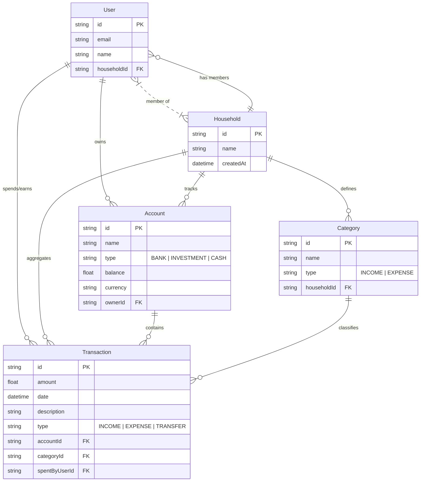

# 2. Database Entity Relationship Diagram

Date: 2026-02-07

## Overview

Visual representation of the Prisma schema, highlighting the relationships between User, Household, Account, and Transaction entities.

## Diagram

